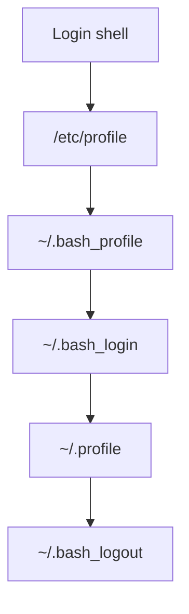
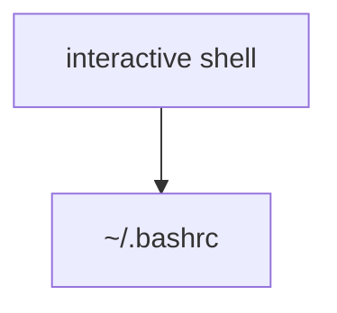
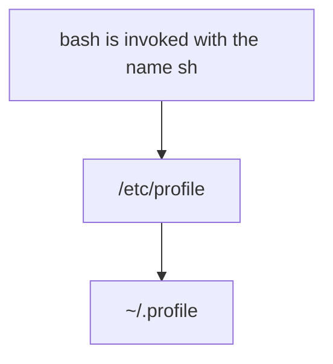
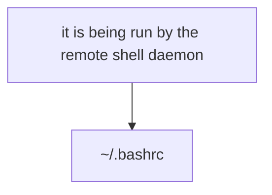

# linux-shell-evaluation
I don't really understand of it. so I look into the _man bash_ document
It is a part of _man bash_ document.

## man bash
Do not read either the system-wide startup file /etc/profile or any of the personal initialization files ~/.bash_profile, ~/.bash_login, or ~/.profile.  By default, bash reads these files when it is invoked as a login
shell (see INVOCATION below).

A login shell is one whose first character of argument zero is a -, or one started with the --login option.
> for example, you can get a login shell, doing by one of following
> ```agsl
> > su -
> > su userid - 
> > ssh host 
> ``` 
An interactive shell is one started without non-option arguments and without the -c option whose standard input and error are both connected to terminals (as determined by isatty(3)), or one started with the -i option.  PS1 is
set and $- includes i if bash is interactive, allowing a shell script or a startup file to test this state.
> interactive shell
> ```agsl
> > bash -i
> ``` 


The following paragraphs describe how bash executes its startup files.  If any of the files exist but cannot be read, bash reports an error.  Tildes are expanded in file names as described below under Tilde Expansion in the
EXPANSION section.

When bash is invoked as an interactive login shell, or as a non-interactive shell with the --login option, it first reads and executes commands from the file /etc/profile, if that file exists.  After reading that file, it looks
for ~/.bash_profile, ~/.bash_login, and ~/.profile, in that order, and reads and executes commands from the first one that exists and is readable.  The --noprofile option may be used when the shell is started to inhibit this
behavior.

When a login shell exits, bash reads and executes commands from the file ~/.bash_logout, if it exists.

When an interactive shell that is not a login shell is started, bash reads and executes commands from ~/.bashrc, if that file exists.  This may be inhibited by using the --norc option.  The --rcfile file option will force bash
to read and execute commands from file instead of ~/.bashrc.

When bash is started non-interactively, to run a shell script, for example, it looks for the variable BASH_ENV in the environment, expands its value if it appears there, and uses the expanded value as the name of a file to read
and execute.  Bash behaves as if the following command were executed:
      if [ -n "$BASH_ENV" ]; then . "$BASH_ENV"; fi
but the value of the PATH variable is not used to search for the file name.

If bash is invoked with the name sh, it tries to mimic the startup behavior of historical versions of sh as closely as possible, while conforming to the POSIX standard as well.  When invoked as an interactive login shell, or a
non-interactive shell with the --login option, it first attempts to read and execute commands from /etc/profile and ~/.profile, in that order.  The --noprofile option may be used to inhibit this behavior.  When invoked as an
interactive shell with the name sh, bash looks for the variable ENV, expands its value if it is defined, and uses the expanded value as the name of a file to read and execute.  Since a shell invoked as sh does not attempt to
read and execute commands from any other startup files, the --rcfile option has no effect.  A non-interactive shell invoked with the name sh does not attempt to read any other startup files.  When invoked as sh, bash enters
posix mode after the startup files are read.

## Diagram






## Conclusion 
Well, I read the document several times. I don't still get it all. In which shell belongs the following?
> interactive shell
> ```agsl
> > bash -c "echo hello"
> >  bash -c "env"
> ``` 
> or running a shell script or in a crontab, I guess "bash is invoked with the name sh"
 
